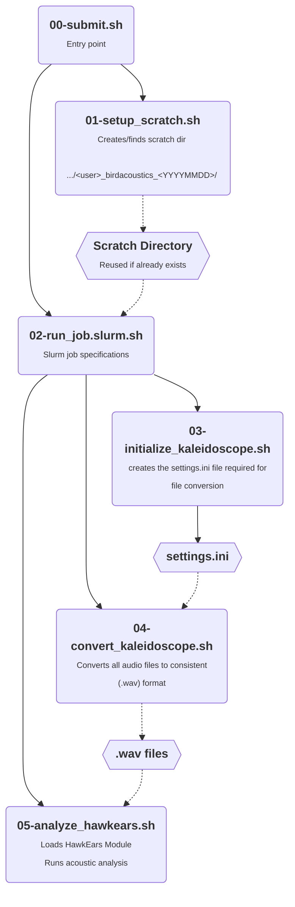

# birdacoustics
## Project Overview

Birds serve as great bioindicators since they occupy a wide range of habitats and their populations respond quickly to environmental change (Kułaga, 2019). It is therefore advantageous to monitor bird populations since they allow for the quick detection of environmental stresses over the entire ecosystem. Detecting these changes is imperitive to measure the impacts of our own development on ecosystems as well as evaluate any measures being taken to remedy our harms. 

This project aims to leverage the use of acoustic data in the monitoring of bird populations, particularly through the use of HawkEars, a machine learning-based approach for acoustic classification of avian species (Huus, 2025). Affiliated with the University of British Columbia, the data for this project comes from acoustic recorders placed in the greater Vancouver area. The scripts contained in this project act as an end-to-end pipeline to process raw acoustic recordings, generate insights, and display valuable information in a digestible format, the ultimate goal of which is to contribute to sustainable development and preserving ecosystem health.

## Workflow

Below is a table containing all the scripts (within in the `src/` directory) and their corresponding utility in the pipeline.
| Script | Description |
| --- | --- |
| `00-submit.sh` | Calls `setup_scratch.sh` then runs `run_job.slurm` as a slurm job. |
| `01-setup_scratch.sh` | Either creates or finds an existing scratch directory of the format `.../<user>/<user>_birdacoustics_<YYYYMMDD>`. |
| `02-run_job.slurm` | Contains slurm specifications. Calls `03-initialize_kaleidoscope.sh`, `04-convert_kaleidoscope.sh`, `05-analyze_hawkears.sh`. |
| `03-initialize_kaleidoscope.sh` | Creates the `settings.ini` file required for Kaleidoscope to run the batch conversion. |
| `04-convert_kaleidoscope.sh`| Uses the `Kaleidoscope` apptainer to batch convert input files (.w4v) to a consistent (.wav) format |
| `05-analyze_hawkears.sh` | Loads `HawkEars` as a module and then runs an analysis. |



## Prerequisites / Setup
This data pipeline is intended to be run on an ARC computing cluster environment that uses the SLURM workload manager. More specifically, it is intended to run on the University of British Columbia's [Sockeye computing cluster](https://arc.ubc.ca/compute-storage/ubc-arc-sockeye). Clone this repository by navigating to your home directory on the computing cluster and entering one of the following commands:

If you have an ssh key set up on the cluster (**recommended for security** [see this guide here](https://docs.github.com/en/authentication/connecting-to-github-with-ssh/generating-a-new-ssh-key-and-adding-it-to-the-ssh-agent)),

```bash
cd ~
git clone git@github.com:SamLokanc/birdacoustics.git
```

Otherwise you can run:

```bash
cd ~
git clone https://github.com/SamLokanc/birdacoustics.git
```

Once the repo is cloned, navigate to the directory containing it using the following command:

```bash
cd birdacoustics
```

## Usage
To run the analysis simply enter the following command from within the cloned repo:

```bash
./src/00-submit.sh
```

Then for the submitted job to finish.

## References
Huus, J., Kelly, K. G., Bayne, E. M., & Knight, E. C. (2025). HawkEars: A regional, high-performance avian acoustic classifier. Ecological Informatics, 87, 103122.

Kułaga, K., & Budka, M. (2019). Bird species detection by an observer and an autonomous sound recorder in two different environments: Forest and farmland. PLoS One, 14(2), e0211970.
