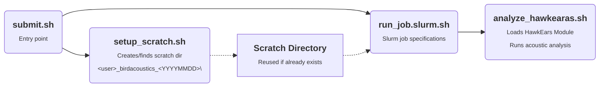

# birdacoustics
## Project Overview
## Workflow

Below is a table containing all the scripts (within in the `src/` directory) and their corresponding utility in the pipeline.
| Script | Description |
| --- | --- |
| `analyze_hawkears.sh` | Loads `HawkEars` as a module and then runs an analysis. |
| `run_job.slurm` | Contains slurm specifications. Calls `analyze_hawkears.sh`. |
| `setup_scratch.sh` | Either creates or finds an existing scratch directory of the format `<username>_birdacoustics_<YYYYMMDD>`. |
| `submit.sh` | Calls `setup_scratch.sh` then runs `run_job.slurm` as a slurm job. |



## Prerequisites / Setup
This data pipeline is intended to be run on an ARC computing cluster environment that uses the SLURM workload manager. More, specifically, it is intended to be run on the University of British Columbia's [Sockeye computing cluster](https://arc.ubc.ca/compute-storage/ubc-arc-sockeye). Clone this repository by navigating to your home directory on the computing cluster and entering one of the following command:

```bash
git clone https://github.com/SamLokanc/birdacoustics.git
```

Or if you have an ssh key set up on the cluster (recommended for security),

```bash
git clone git@github.com:SamLokanc/birdacoustics.git
```

Once the repo is cloned navigate to the directory containing it using the following command:

```bash
cd birdacoustics
```

## Usage
To run the analysis simply enter the following command from within the cloned repo:

```bash
./src/submit.sh
```

Then simply wait for the submitted job to finish.
